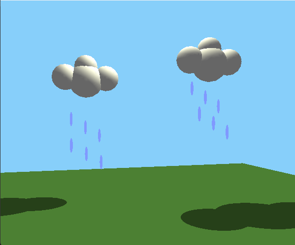

# skyWclouds

Stylized Legacy OpenGL scene with clouds, rain, ground, and projected shadows.



## Features
- Two multi-sphere clouds with simple lighting
- Projected cloud shadows onto the ground plane
- Animated raindrops below each cloud cluster
- Keyboard-controlled camera yaw and sun position

## Controls
| Key | Action |
| --- | --- |
| Left/Right arrows | Rotate camera around Y |
| W / S | Move sun up / down |
| A / D | Move sun left / right |
| Q / E | Move sun forward / back |

## Build
This project uses legacy **GLAUX** for windowing/input, plus OpenGL and GLU. Make sure your toolchain provides `glaux.h` and the corresponding library.

**Windows (MSVC)**
```
cl scene.c /I"path\to\OpenGL\include" /link opengl32.lib glu32.lib glaux.lib
```

**Windows (MinGW)**
```
gcc scene.c -o skyWclouds.exe -lopengl32 -lglu32 -lglaux
```

**Linux (if GLAUX is available)**
```
gcc scene.c -o skyWclouds -lGL -lGLU -lglaux
```

If your platform does not ship GLAUX, porting the windowing/input layer to GLUT/FreeGLUT is the recommended approach.

## Run
```
./skyWclouds
```

## Project layout
- `scene.c` — rendering, input, and animation
- `screenshot.png` — preview image
- `LICENSE` — MIT

## License
MIT
